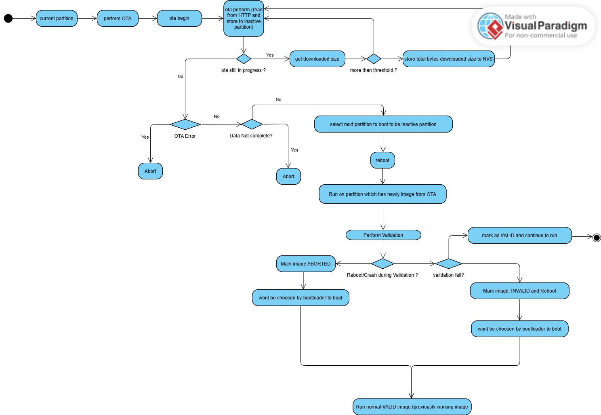

### How to Encounter Power Loss 

It actually helped by using ESP IDF native ota apis and https ota apis.

1. First, we look at local problem. Which is the writing to flash problem. This actaully solved by using ota_0 and ota_1 mechanism and rollback mechanism I explained in README.md .

Suppose , power loss happens during mid writing. This firmware is corrupt (marked as aborted if you follow README.md diagram) lets say 0ta_1 partition. But the running firmware is on 0ta_0 so it doesnt affect so it solved. 

The key is selection of available partitions : 
ota_0 then ota_1 then ping-pong as inactive app partition will be used for next update. If next update corrupt you still boot on active normal running app. If it doesnt corrupt but defects then you can rollback.


2. Communication/Network related. Which is the network. For this (But this is also personally my decision is problematic) , is use Resumption method using esp_https_ota api. Where you store received bytes , then you store this information to NVS :

```c
        // Fetch current cumulative bytes written (including previous attempts)
        int bytes_read = esp_https_ota_get_image_len_read(ota_handle);

        // Save progress to NVS periodically (e.g., every 10 loop cycles) to protect Flash endurance
        if (chunk_counter++ % 10 == 0) {
            nvs_set_u32(nvs_handle, NVS_KEY_OFFSET, (uint32_t)bytes_read);
            nvs_commit(nvs_handle);
        }
```

this is from this function in `ota_app.c` : 
```c
static void ota_run_task(void *pvParameter) 
```


```c
....
    while(1) {
        err = esp_https_ota_perform(ota_handle);
        if (err != ESP_ERR_HTTPS_OTA_IN_PROGRESS) {
            break; // Complete or broke off due to error
        }

        // Fetch current cumulative bytes written (including previous attempts)
        int bytes_read = esp_https_ota_get_image_len_read(ota_handle);

        // Save progress to NVS periodically (e.g., every 10 loop cycles) to protect Flash endurance
        if (chunk_counter++ % 10 == 0) {
            nvs_set_u32(nvs_handle, NVS_KEY_OFFSET, (uint32_t)bytes_read);
            nvs_commit(nvs_handle);
        }

        // Print Progress Indicators bytes read / total file size * 100 = percentage.
        if (total_file_size > 0) {
            int percentage = (bytes_read * 100) / total_file_size;
            if (percentage != last_percentage) {
                ESP_LOGI(TAG, "OTA Progress: %d%% (%d / %d bytes)", percentage, bytes_read, total_file_size);
                last_percentage = percentage;
            }
        }

        // vTaskDelay(pdMS_TO_TICKS(100)); // Avoid tight loop
    }

    // after reason break loop, check if OTA was successful
    if (err != ESP_OK) {
        ESP_LOGE(TAG, "OTA stopped mid-download (Error: %d). Progress cached to NVS.", err);
        // Do NOT call abort here if you want to keep the partition data for next time!
        // Just cleanly exit the handle context
        esp_https_ota_abort(ota_handle); 
    } 
    else if (esp_https_ota_is_complete_data_received(ota_handle) != true) {
        ESP_LOGE(TAG, "File transmission incomplete.");
        esp_https_ota_abort(ota_handle);
    } 
    else {
        // Success path! Wipe NVS tracker token so next update starts cleanly from 0
        nvs_erase_key(nvs_handle, NVS_KEY_OFFSET);
        nvs_commit(nvs_handle);

        err = esp_https_ota_finish(ota_handle);
        if (err == ESP_OK) {
            ESP_LOGI(TAG, "Update completely verified! Rebooting now...");
            vTaskDelay(pdMS_TO_TICKS(1000));
            nvs_close(nvs_handle);
            esp_restart();
        } else {
            ESP_LOGE(TAG, "Failed to apply boot flag. Error: %d", err);
        }
    }

cleanup:
    if (is_ota_handler_registered) {
        esp_event_handler_unregister(ESP_HTTPS_OTA_EVENT, ESP_EVENT_ANY_ID, &ota_event_handler);
        ESP_LOGI(TAG, "OTA handler unregistered safely during cleanup.");
    }
    nvs_close(nvs_handle);
    vTaskDelete(NULL);
```

But this is introduction new problem since I actually depend on FLASH writing for tracking image downloaded. 

You may see this image : 
