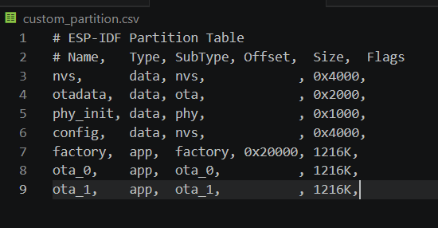
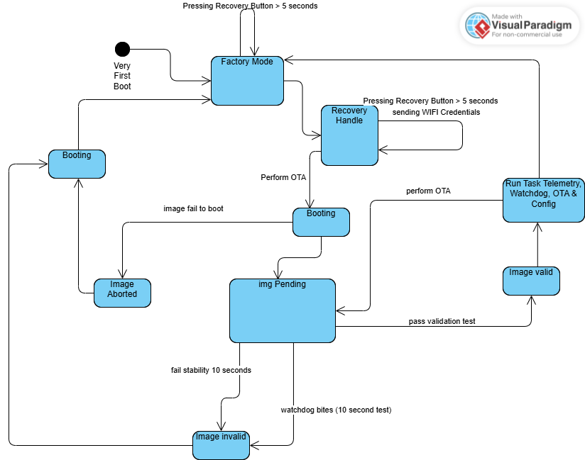
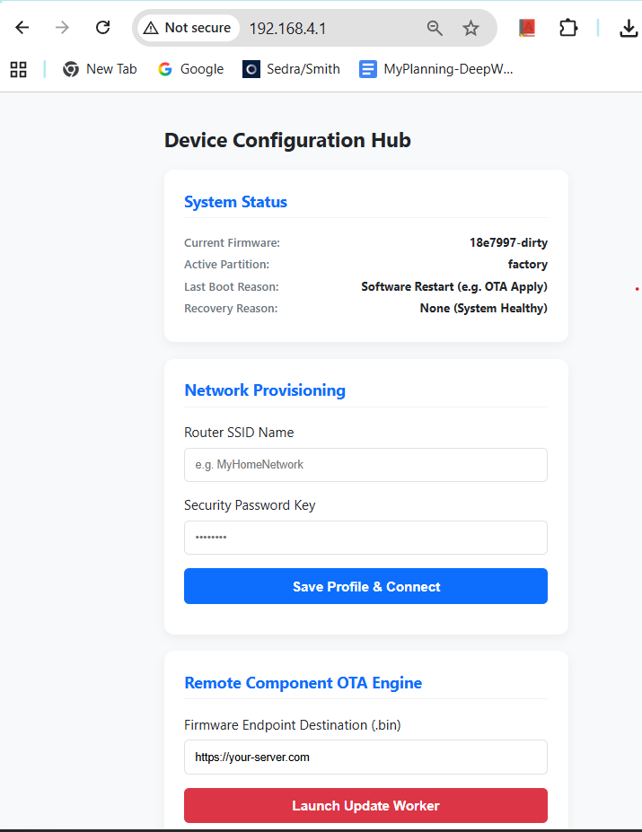

# Firmware Update Task

## Highlevel Architecture

System : 
- esp32 c3 4 MB internal Flash , Using ESP32 C3 SuperMini Board
- esp idf  : ESP-IDF v5.5.4

Tools : 
- Vscode

Partition Table 


Here I use 3 app partitions : 
- factory (for failsafe)
- ota_0 
- ota_1

Using at least 2 app partitions (ota_0 and ota_1), are for safety and rollback usage.

### Files and Directories : 
| Files/Folder | Explanation | Comments |
| -------- | -------- | -------- |
| /main  | main progam  | Row 1 C  |
| /components  | component modules  | Row 2 C  |
| /assets  |  image used in README.md |   |
| /web  |  contains index.hmtl for Recovery Config  |
| custom_partition.csv  |  custom partition table contain factory, ota_0 , ota_1  |
| ota_test.py  |  python script for testing ota  |


### Components directory : 
| Files/Folder | Explanation | Comments |
| -------- | -------- | -------- |
| /boardled  | driver board led  | Row 1 C  |
| /config_portal_ap  | http server and webportal  | Row 2 C  |
| /ota_app  |  handle ota task |   |
| /task_simulation  |  telemetry, wathcdog, ota & config  |
| wifi_ble_provisioning  |  NOT USED  |


## the OTA state machine / flow




## How Rollback Works 

The rollback mechanism lies in this function, since I use native ota API. 

1. First , if image cant reboot then , Based on the state machine above, from previous OTA process the firmware is marked `ESP_OTA_IMAGE_PENDING`. 
Then since it can boot then it will be marked as `ABORTED`. Then in next booting , bootloader will choose other than this image. It could be factory if no other ota_x available or other ota_x if it has `VALID` mark.

2. If lets say it can boot, this is marked as `ESP_OTA_IMAGE_PENDING_VERIFY` then we perform validation logic.

3. Validation logic contains two process : 
- First, test 10 seconds stability (I just use vTaskDelay)
- The simulated watchdog, which I use for loop , every 2.5 seconds `critical_loop_heartbeat` will be set to `false` , if `critical_loop_heartbeat` is not updated to `true`. If will mark the firmware as `INVALID` and then reboot the device. In my case I create simple task to change the variable to `true`. The time window for this validation test is 10 secodns, so 4 times changing the variable.

4. If it pass all validation tests. Then the firmware will be marked as `VALID` and continue to run other tasks logic (Telemetry, OTA Task).


```c
void run_ota_logic(void) {
    ESP_LOGI(TAG, "Running OTA logic...");
    // 1. Check for available OTA updates
    // 2. Download and install updates if available
    // 3. Reboot if necessary
    const esp_partition_t *running = esp_ota_get_running_partition();
    esp_ota_img_states_t ota_state;
    if (esp_ota_get_state_partition(running, &ota_state) == ESP_OK) {
        if (ota_state == ESP_OTA_IMG_PENDING_VERIFY) {

            // Validation logic: If the app is running correctly, mark it as valid to cancel rollback
            ESP_LOGI(TAG, "App is in PENDING_VERIFY state. Starting stability checks...");
            // 1. Simulate stability period 10 seconds.
            vTaskDelay(pdMS_TO_TICKS(10000)); // Simulate some validation checks
            bool system_checks_passed = true; 

            // 2. Simulate a watchdog check
            for (int i = 0; i < 4; i++) {
                vTaskDelay(pdMS_TO_TICKS(2500));
        
                if (!critical_loop_heartbeat) {
                    ESP_LOGE(TAG, "CRITICAL WATCHDOG ERROR: Loop is frozen inside the 10s stability window!");
                    esp_ota_mark_app_invalid_rollback_and_reboot(); 
                }
                critical_loop_heartbeat = false; 
            }

            if (system_checks_passed) {
                esp_err_t err = esp_ota_mark_app_valid_cancel_rollback();
                if (err == ESP_OK) {
                    ESP_LOGI(TAG, "🏆 SUCCESS: Stability period met! New firmware locked in permanently.");
                } else {
                    ESP_LOGE(TAG, "Failed to confirm validity flag: %s", esp_err_to_name(err));
                }
            } else {
                ESP_LOGE(TAG, "🚨 Self-checks failed during stability period! Forcing manual rollback...");
                esp_ota_mark_app_invalid_rollback_and_reboot();
            }
        }
    }

    normal_blink();
    while(1) {
        vTaskDelay(pdMS_TO_TICKS(1000));
    }
}
```


## NVS Keys Lists

| Macro Name           | NVS Key / Namespace | Explanation                                        |
| -------------------- | ------------------- | -------------------------------------------------- |
| `NVS_WIFI_NAMESPACE` | `wifi_store`        | Namespace used to store WiFi-related settings      |
| `NVS_KEY_SSID`       | `wifi_ssid`         | Key for storing the WiFi network SSID              |
| `NVS_KEY_PASS`       | `wifi_pass`         | Key for storing the WiFi network password          |
| `NVS_OTA_NAMESPACE`  | `stored_ota`        | Namespace used to store OTA update information     |
| `NVS_KEY_OFFSET`     | `bytes_written`     | Key for tracking OTA update progress (byte offset) |


